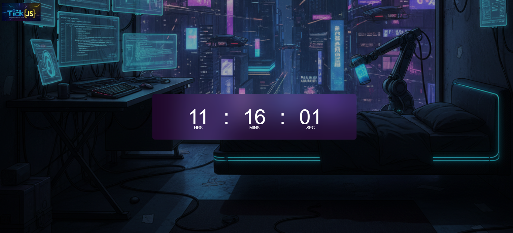

# 🕒 TickJS - Cyberpunk Digital Clock



## 💻 Sobre o Projeto
O **TickJS** é um relógio digital desenvolvido com tecnologias web puras (Vanilla) focado em estética e performance. O projeto apresenta um visual **Cyberpunk** imersivo, utilizando técnicas modernas de CSS como *Glassmorphism* (efeito de vidro fosco) para destacar o relógio sobre um cenário de fundo detalhado.

## 🚀 Funcionalidades
* **Tempo Real:** Atualização síncrona de horas, minutos e segundos.
* **Glassmorphism:** Interface translúcida com desfoque de fundo (`backdrop-filter`).
* **Design Cyberpunk:** Cenário e logo personalizados gerados por IA para uma imersão futurista.
* **Responsividade Visual:** Layout centralizado e adaptável ao tamanho da tela.

## 🛠️ Tecnologias Utilizadas
* **HTML5:** Estruturação semântica.
* **CSS3:** Flexbox, posicionamento absoluto, gradientes e Glassmorphism.
* **JavaScript (Vanilla):** Manipulação do DOM e uso do objeto `Date` em conjunto com `setInterval`.

## 📂 Como executar o projeto
Como é um projeto puramente Front-end, você não precisa de nenhuma instalação complexa:
1. Faça o clone deste repositório:
   ```bash
   git clone [https://github.com/carvalhotamires/TickJS.git](https://github.com/carvalhotamires/TickJS.git)